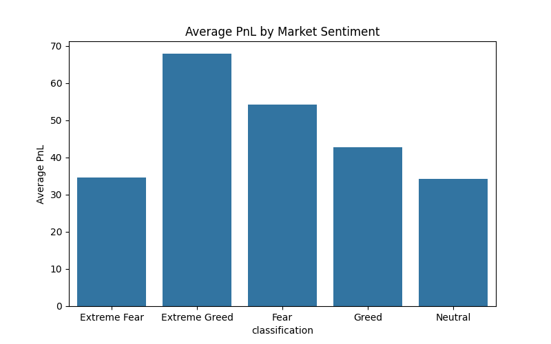

# Trader Behavior Analysis with Bitcoin Fear & Greed Sentiment

## Project Summary
This project evaluates how market sentiment relates to trader performance by combining:
- Hyperliquid historical trade data
- Bitcoin Fear & Greed Index data

The analysis produces sentiment-wise performance metrics and visualizations to highlight patterns in profitability, win rate, and trading activity.

## Business Question
How does market sentiment (Extreme Fear to Extreme Greed) influence trading outcomes and behavior?

## Key Outcomes
- Average PnL by sentiment class
- Win rate by sentiment class
- Trade volume distribution across sentiment classes
- A processed merged dataset: [processed_trader_data.csv](processed_trader_data.csv)

## Result Snapshot


## Observed Results (From Current Run)

### Average PnL by Sentiment
| Sentiment | Average PnL |
|---|---:|
| Extreme Fear | 34.54 |
| Fear | 54.29 |
| Neutral | 34.31 |
| Greed | 42.74 |
| Extreme Greed | 67.89 |

### Win Rate by Sentiment
| Sentiment | Win Rate |
|---|---:|
| Extreme Fear | 37.06% |
| Fear | 42.08% |
| Neutral | 39.70% |
| Greed | 38.48% |
| Extreme Greed | 46.49% |

### Trade Count by Sentiment
| Sentiment | Trades |
|---|---:|
| Extreme Fear | 21,400 |
| Fear | 61,837 |
| Neutral | 37,686 |
| Greed | 50,303 |
| Extreme Greed | 39,992 |

### Quick Takeaways
- Extreme Greed shows the highest average PnL and win rate.
- Fear performs better than Greed on both average PnL and win rate.
- Trade activity is highest in Fear and Greed periods.

## Methodology
1. Loaded raw trade and sentiment CSV files.
2. Standardized inconsistent column names.
3. Parsed timestamps and extracted dates.
4. Merged datasets on date.
5. Engineered features:
   - `PnL`: per-trade closed profit/loss
   - `is_profit`: profitability flag
   - `side`: encoded as BUY = 1, SELL = -1
6. Computed grouped metrics and generated plots.

## Tech Stack
- Python
- Pandas
- NumPy
- Matplotlib
- Seaborn

## Project Structure
```
Prime trade task/
|-- analysis.py
|-- historical_data.csv
|-- fear_greed_index.csv
|-- Figure_1.png
|-- requirements.txt
|-- .gitignore
`-- README.md
```

## Setup
### 1. Create and activate an environment (PowerShell)
```powershell
python -m venv .venv
.\.venv\Scripts\Activate.ps1
```

### 2. Install dependencies
```powershell
pip install -r requirements.txt
```

## Run
```powershell
python analysis.py
```

If you use Conda, this also works:
```powershell
conda activate cv_conda
python analysis.py
```

## Notes for Recruiters
- This repository demonstrates practical data engineering and analysis workflow:
  - Data cleaning for real-world schema inconsistencies
  - Feature engineering for behavioral analytics
  - Statistical aggregation with clear business interpretation
  - Reproducible script-based workflow

## Author
Shanmukesh (Prime Trade Task)
